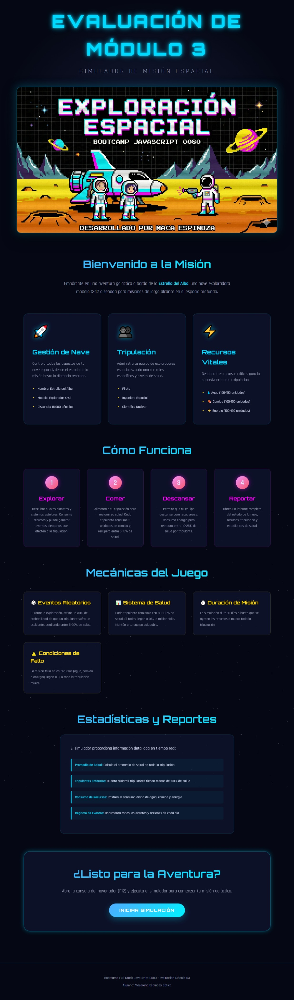

**Bootcamp Full Stack JavaScript 0080 - Evaluación Módulo 03**  
**Alumna**: Macarena Espinoza Gatica

# Exploración Galáctica - Landing Page

## Resumen

Pequeña aplicación de Javascript que simula una misión espacial.

## Archivos del proyecto

### [index.html]

Página HTML completa con estructura semántica que incluye:
- **Hero Section**: Título animado con efecto glitch y la imagen de portada
- **Introducción**: Descripción general de la misión
- **Características**: 3 tarjetas explicando gestión de nave, tripulación y recursos
- **Cómo Funciona**: 4 pasos del gameplay (Explorar, Comer, Descansar, Reportar)
- **Mecánicas del Juego**: 4 tarjetas con eventos aleatorios, sistema de salud, duración y condiciones de fallo
- **Estadísticas**: Información sobre los reportes disponibles
- **Call to Action**: Botón para iniciar la simulación
- **Footer**: Créditos del bootcamp y alumna

### [assets/css/styles.css](assets/css/styles.css)

Hoja de estilos completa con diseño espacial que incluye:
- **Variables CSS**: Paleta de colores cian, magenta y dorado
- **Starfield Animado**: 3 capas de estrellas en movimiento continuo
- **Efectos de Luz**: Sombras brillantes (glow) en elementos interactivos
- **Animaciones**: Glitch en el título, flotación en la imagen, fade-in en secciones
- **Hover Effects**: Transformaciones y efectos de brillo al pasar el mouse
- **Gradientes**: Degradados vibrantes en títulos y botones
- **Responsive Design**: Adaptación completa a dispositivos móviles

## Características del Diseño

### Estética Premium
- Paleta de colores basada en la imagen de portada (cyan, magenta, dorado)
- Tipografías modernas: Orbitron (títulos) y Rajdhani (texto)
- Efectos glassmorphism en tarjetas
- Animaciones suaves y micro-interacciones

### Efectos Visuales
- Campo de estrellas animado en 3 capas
- Efecto glitch en el título principal
- Imagen del hero con hover effect

### Responsive
- Grid adaptativo para todas las secciones
- Tamaños de fuente fluidos con `clamp()`
- Diseño completamente responsive

## Demostración Visual

## Cómo Usar

1. Abre `index.html` en tu navegador
2. Navega por las diferentes secciones para conocer la aplicación
3. Abre la consola del navegador (F12) para ver la simulación en acción
4. El script `simuladorMision.js` se carga automáticamente al final de la página

## Tecnologías Utilizadas

- **HTML5**: Estructura semántica
- **CSS3**: Animaciones, gradientes, efectos visuales
- **Google Fonts**: Orbitron y Rajdhani
- **JavaScript**: Simulador de misión compatible con Node.js

---

**Bootcamp Full Stack JavaScript 0080 - Evaluación Módulo 03**  
**Alumna**: Macarena Espinoza Gatica
